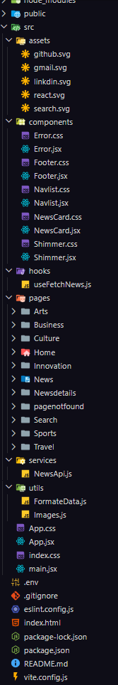

# 📰 NewsHub - Responsive Navbar Component

A modern, fully responsive navigation bar built with React and pure CSS. Features a sleek design with hamburger menu, search functionality, and smooth animations.


## ✨ Features

- 🎨 **Modern Gradient Design** - Beautiful blue gradient with glassmorphism effects
- 📱 **Fully Responsive** - Works seamlessly on desktop, tablet, and mobile devices
- 🍔 **Animated Hamburger Menu** - Smooth transition to X icon when opened
- 🔍 **Search Functionality** - Built-in search bar with enter key support
- 🎯 **Active Link Highlighting** - Visual indicator for current page
- ⚡ **Smooth Animations** - Slide-down menu and hover effects
- 📌 **Sticky Navigation** - Stays at the top while scrolling
- ♿ **Accessible** - Keyboard navigation and focus indicators
- 🚫 **Zero Dependencies** - No external libraries required (except React)

## 🚀 Quick Start

### Prerequisites

- Node.js (v14 or higher)
- npm or yarn

### Installation

1. Clone the repository:
```bash
git clone https://github.com/yourusername/newshub-navbar.git
cd newshub-navbar
```

2. Install dependencies:
```bash
npm install
# or
yarn install
```

3. Start the development server:
```bash
npm start
# or
yarn start
```

4. Open [http://localhost:3000](http://localhost:3000) to view it in your browser.

## 📁 Project Structure




### State Management

The component manages the following states:

- `isMenuOpen` - Controls mobile menu visibility
- `searchQuery` - Stores search input value
- `activeLink` - Tracks currently active navigation link

## 📱 Responsive Breakpoints

| Device | Breakpoint | Features |
|--------|------------|----------|
| Desktop | > 1024px | Full horizontal menu with all links visible |
| Tablet | 768px - 1024px | Compact menu with smaller padding |
| Mobile | < 768px | Hamburger menu activated |
| Small Mobile | < 480px | Logo text hidden, full-width search |

## 🎭 Browser Support

- ✅ Chrome (latest)
- ✅ Firefox (latest)
- ✅ Safari (latest)
- ✅ Edge (latest)
- ✅ Opera (latest)


### Code Style

This project follows standard React conventions:
- Functional components with hooks
- CSS-in-JS for styling
- camelCase for variable names
- PascalCase for component names

## 🎨 Design System

### Colors

```css
Primary: #2c3e50
Secondary: #3498db
Accent: #e74c3c
Text Light: #ffffff
Text Dark: #333333
Background: #f5f5f5
```

### Typography

- Font Family: -apple-system, BlinkMacSystemFont, 'Segoe UI', Roboto
- Base Font Size: 16px (1rem)
- Logo: 1.5rem (24px)
- Nav Links: 0.95rem (15.2px)

### Spacing

- Container Padding: 1rem 2rem
- Link Padding: 0.75rem 1.25rem
- Gap: 0.5rem - 2rem

## 🚀 Performance

- **Lightweight**: No external dependencies
- **Optimized**: Minimal re-renders with React state
- **Fast**: CSS animations hardware-accelerated
- **Efficient**: Lazy loading ready

## ♿ Accessibility

- Semantic HTML structure
- Keyboard navigation support
- Focus indicators on all interactive elements
- High contrast mode support
- Screen reader friendly


### Tab menu not appearing
- Check if the `max-width: 1200px` media query is being applied
- Ensure JavaScript is enabled
- Verify `isMenuOpen` state is toggling


### Styling issues
- Clear browser cache
- Check for CSS specificity conflicts
- Verify all styles are within the spacial css file tag

### Contribution Guidelines

- Follow the existing code style
- Add comments for complex logic
- Test on multiple browsers

## 👨‍💻 Author

**Your Name**
- GitHub: [@yourusername](https://github.com/raviranjanmishra01)
- LinkedIn: [Your Name](http://www.linkedin.com/in/ravi-ranjan-mishra-9919b2310)

## 🙏 Acknowledgments

- Inspired by modern news websites
- Built with React best practices
- CSS animations inspired by Material Design


## 📊 Changelog

### Version 1.0.0 (2024-12-27)
- Initial release
- Responsive navbar with hamburger menu
- Search functionality
- Active link highlighting
- Smooth animations

---

Made with ❤️ by Ravirajan kumar

⭐ Star this repo if you find it helpful!